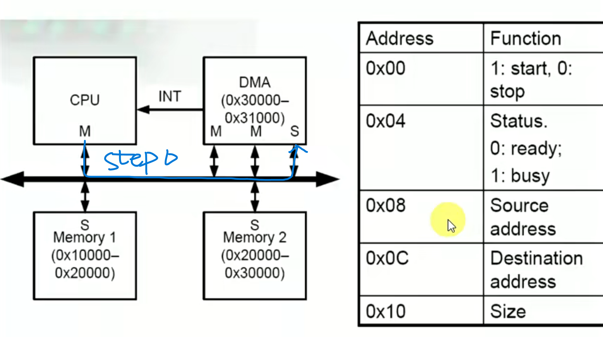
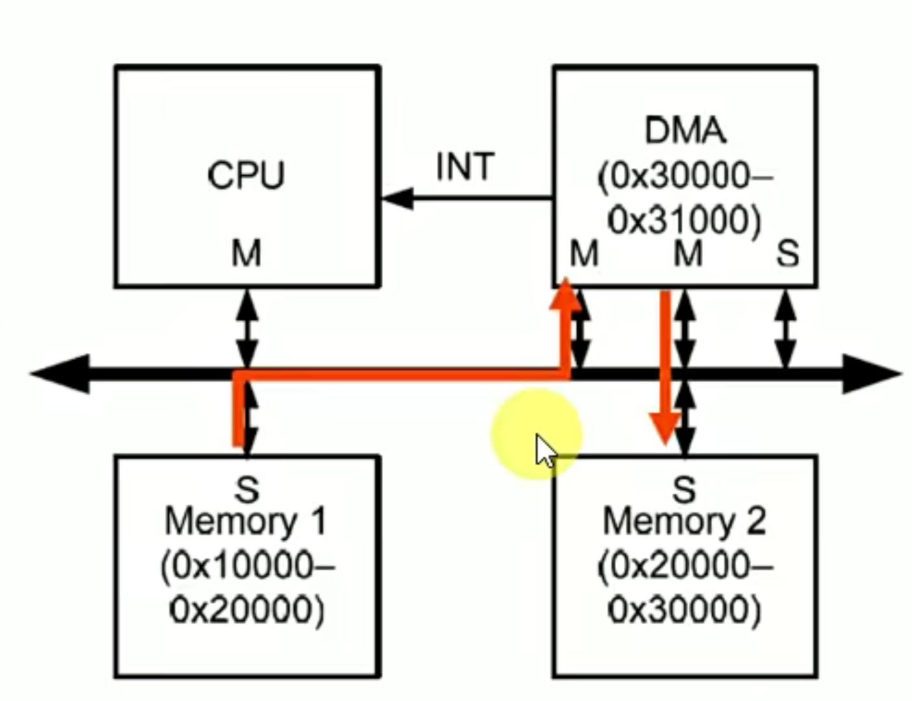
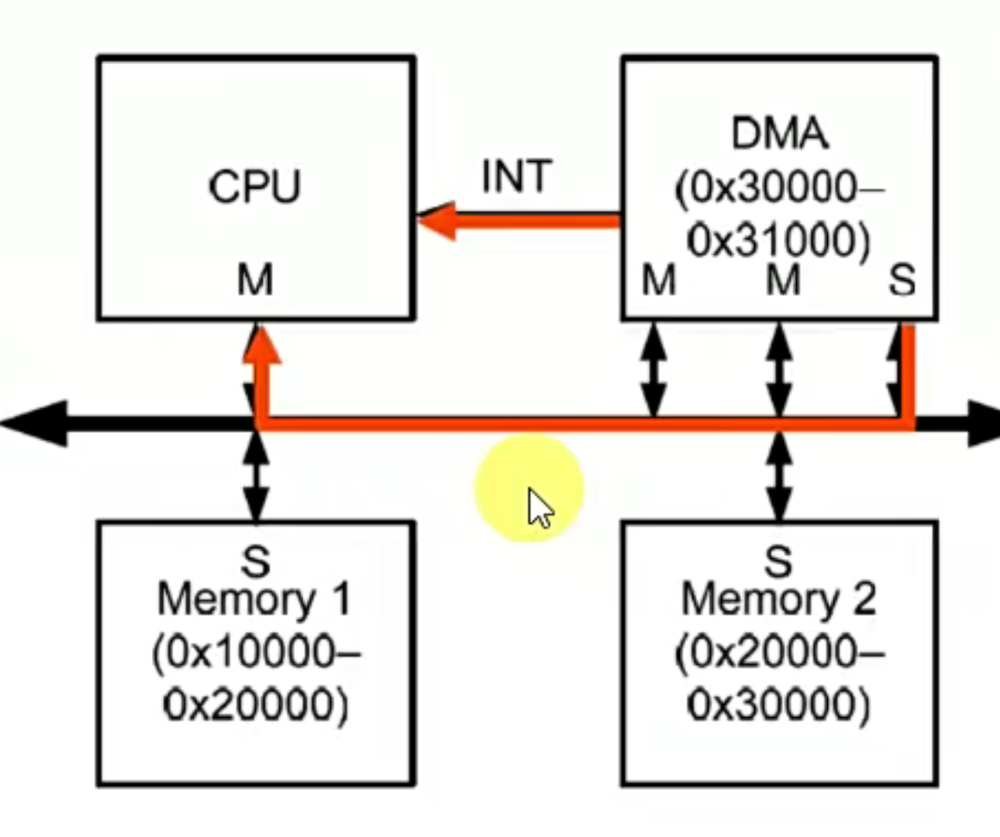

step 0 : CPU 检查 DMA 是否可用

```c
# C 语言 伪代码
while(1)
{
    read(0x30004,&status) //将 DMA 寄存器 0x30004 写到 status
    if(status == 0) // DMA 可用
        break;
}
```



step 1 :  CPU 设置要搬运的数据 source address , destination address , size

CPU 向 DMA 配置寄存器内写数据，完成基本配置

```c
write(0x30008,0x10000) // 对应上表中的 source address
write(0x3000c,0x20000) // 对应上表中的 destination address
write(0x30010,0x100)   // 128 bytes 或 128 bit
```


step 2 : 启动 DMA

```c
write(0x30000,0x1)
```


step3 : DMA 开始工作，将数据从 memory1 搬运到 memory2



比如，通过 brust8 的方式将数据搬运到 DMA 的 FIFO 中，再传到 mem2 中。

不用 CPU 搬运的原因

+ CPU 受制于数据位宽或路径长度，搬运大量数据比较耗时
+ CPU 每次操作之间有 IDLE 
+ CPU 需要做很多工作，会被经常中断

step 4 : DMA 发送完成，向 CPU 发送中断



step 5 : CPU 检查 DMA 状态，确认中断是不是真的。

```c
read(0x30004,&status)
```

