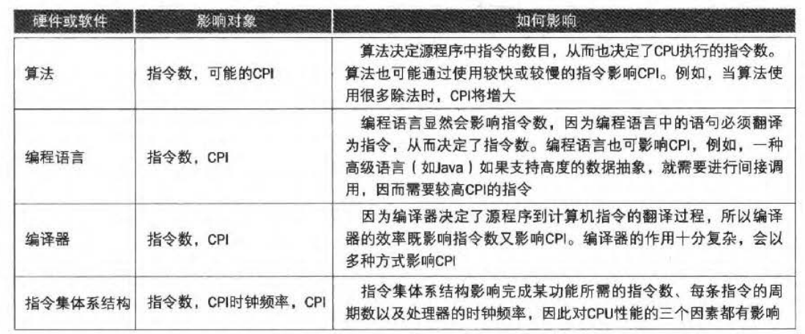

# 1. 响应时间

计算机完成一项任务所需的总时间，包括磁盘访问、内存访问、I/O 操作、操作系统开销以及 CPU 执行时间。

# 2. 吞吐率/带宽

单位时间内完成的任务量。

# 3. 性能

性能 = 1/执行时间

# 4. CPI

每条指令所需的平均周期数。

CPI 最小值不为 1.0。某些处理器在每个时钟周期可以对多条指令取指并执行。

# 5. IPC

每周期执行指令数。 IPC = 2。CPI = 0.5。

# 6. 功耗墙

CMOS 动态功耗：
$$
动态功耗 \propto 1/2 \times 负载电容 \times 电压^2 \times 开关频率
$$
CMOS 静态功耗：占 40%

